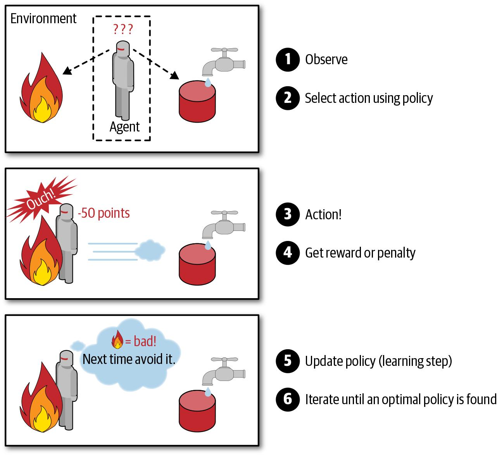

# Introduction to Machine Learning
This is a write-up about Machine Learning for beginners, who have basic python programming skill (variables, function, data types).It would show you what you need to get started and resources to use. It is also a diary of what i have learnt so far. 

One of the easiest ways I got into the habit of learning about machine learning related concepts and building models, was setting out 2-3 hours everyday. This can also be combined with coding everyday for the next 100 days. Here is a pattern you can follow [#100daysofmlcodes](LOG.md)
---
## Into the big scary void. 
## Date : 20-06-2020
## Topics
    1. What is machine learning 
    2. Types of machine learning
    3. What can it be used for 
    
"Machine learning" the technological buzz word that is swiping through the media and tech spaces. considered one of the most lucrative jobs of the century what is it and how do we use it.

So what is Machine Learning, Machine learning is about extracting knowledge from data, it is about making computer do certain task without being explicitly programmed,which in the long run helps human increase productivity and decision making process.

Machine learning is also a subset of another technological buzzword 'Artificial Intelligence' which has to deal with using available data to make decisions. Software like Google map which gives the direction of a location, Amazon alexi, facial recognition softwares are all possible because of machine learning.

### Terms :
* Individual data about an object is called `Sample/Instance`
* Each property of an objects data is called a `Feature`
* Collection of data and it's properties is called a `Dataset`
* Subset of the dataset that is used to train the machine is called the `Traing set`

### Types:
There are three (3) types of machine learning and each has a spefic job it is good at doing, i would go through each and show where they are used in real life.

#### Supervised Learning : 
* "In supervised learning, the training set you feed to the algorithm includes the desired solutions, called labels".In other words the machine receives a dataset that contains all the properties of dataset and also a feature that is the desired answer of that sample.
An example of supervised learning is classifying (name) each fruit in a basket of fruits .ie. classifying each fruit into it's individual class.

#### Unsupervied Learning :
* This is the opposite of supervised learning, with the exception of providing the desired answer of that sample. An example is trying to segment the customers in a store into different groups based on what they purchased.

#### Reinforcement Learning : 
* "The learning system, called an agent in this context, can observe the environment, select and perform actions, and get rewards in return. It must then learn by itself what is the best strategy, called a policy, to get the most reward over time. A policy defines what action the agent should choose when it is in a given situation".

(image curtesy Hands-on Machine Learning with Scikit-Learn, Keras & TensorFlow by Aurélien Géron)

## Uses of Machine Learning:
    1. Analyzing images of products on a production line to automatically classify them
    2. Detecting tumors in brain scans
    3. Automatically flagging offensive comments on discussion forums
    4. Forecasting your company’s revenue next year, based on many performance metrics
    5. Making your app react to voice commands
    6. Detecting credit card fraud
    7. Recommending a product that a client may be interested in, based on past purchases

---    
## Making Tea
## Date :
## Topics : Resources for learning machine learning for beginners.
